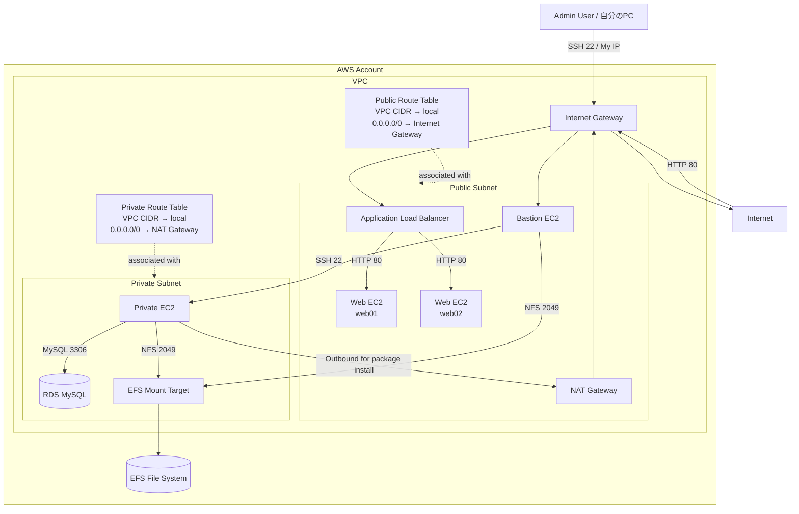

## Core Infrastructure Architecture

```mermaid
flowchart TB
    admin[Admin User / 自分のPC]
    internet[Internet]

    subgraph aws[AWS Account]
        subgraph vpc[VPC]
            igw[Internet Gateway]

            subgraph public[Public Subnet]
                alb[Application Load Balancer]
                bastion[Bastion EC2]
                web01[Web EC2<br/>web01]
                web02[Web EC2<br/>web02]
                nat[NAT Gateway]
            end

            subgraph private[Private Subnet]
                privateEc2[Private EC2]
                rds[(RDS MySQL)]
                efsMt[EFS Mount Target]
            end

            publicRt["Public Route Table<br/>VPC CIDR → local<br/>0.0.0.0/0 → Internet Gateway"]
            privateRt["Private Route Table<br/>VPC CIDR → local<br/>0.0.0.0/0 → NAT Gateway"]
        end

        efs[(EFS File System)]
    end

    internet -->|HTTP 80| igw
    igw --> alb

    alb -->|HTTP 80| web01
    alb -->|HTTP 80| web02

    admin -->|SSH 22 / My IP| igw
    igw --> bastion
    bastion -->|SSH 22| privateEc2

    privateEc2 -->|MySQL 3306| rds

    bastion -->|NFS 2049| efsMt
    privateEc2 -->|NFS 2049| efsMt
    efsMt --> efs

    privateEc2 -->|Outbound for package install| nat
    nat --> igw
    igw --> internet

    publicRt -. associated with .-> public
    privateRt -. associated with .-> private
```
