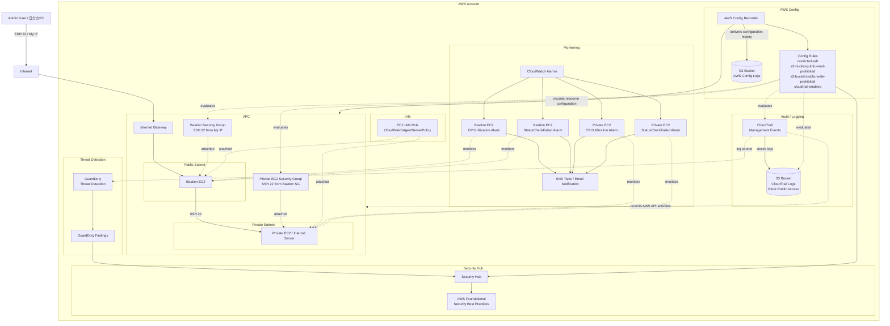

# AWS Security Basic Lab Architecture

```mermaid
flowchart TB
    admin[Admin User / 自分のPC]
    internet[Internet]

    subgraph aws[AWS Account]
        subgraph vpc[VPC]
            igw[Internet Gateway]

            subgraph public[Public Subnet]
                bastion[Bastion EC2]
            end

            subgraph private[Private Subnet]
                privateEc2[Private EC2 / Internal Server]
            end

            bastionSg[Bastion Security Group<br/>SSH 22 from My IP]
            privateSg[Private EC2 Security Group<br/>SSH 22 from Bastion SG]
        end

        subgraph iam[IAM]
            ec2Role[EC2 IAM Role<br/>CloudWatchAgentServerPolicy]
        end

        subgraph audit[Audit / Logging]
            cloudtrail[CloudTrail<br/>Management Events]
            trailBucket[(S3 Bucket<br/>CloudTrail Logs<br/>Block Public Access)]
        end

        subgraph config[AWS Config]
            configRecorder[AWS Config Recorder]
            configRules[Config Rules<br/>restricted-ssh<br/>s3-bucket-public-read-prohibited<br/>s3-bucket-public-write-prohibited<br/>cloudtrail-enabled]
            configBucket[(S3 Bucket<br/>AWS Config Logs)]
        end

        subgraph detection[Threat Detection]
            guardduty[GuardDuty<br/>Threat Detection]
            gdFinding[GuardDuty Findings]
        end

        subgraph securityhub[Security Hub]
            secHub[Security Hub]
            standards[AWS Foundational<br/>Security Best Practices]
        end

        subgraph monitoring[Monitoring]
            cwAlarm[CloudWatch Alarms]

            bastionCpu[Bastion EC2<br/>CPUUtilization Alarm]
            bastionStatus[Bastion EC2<br/>StatusCheckFailed Alarm]

            privateCpu[Private EC2<br/>CPUUtilization Alarm]
            privateStatus[Private EC2<br/>StatusCheckFailed Alarm]

            sns[SNS Topic / Email Notification]
        end
    end

    admin -->|SSH 22 / My IP| internet
    internet --> igw
    igw --> bastion

    bastion -->|SSH 22| privateEc2

    bastionSg -. attached .-> bastion
    privateSg -. attached .-> privateEc2

    ec2Role -. attached .-> bastion
    ec2Role -. attached .-> privateEc2

    cloudtrail -->|stores logs| trailBucket
    cloudtrail -. records AWS API activities .-> vpc
    cloudtrail -. log source .-> guardduty

    configRecorder -->|records resource configuration| vpc
    configRecorder -->|delivers configuration history| configBucket
    configRecorder --> configRules

    configRules -. evaluates .-> bastionSg
    configRules -. evaluates .-> privateSg
    configRules -. evaluates .-> trailBucket
    configRules -. evaluates .-> cloudtrail

    guardduty --> gdFinding

    gdFinding --> secHub
    configRules --> secHub
    secHub --> standards

    cwAlarm --> bastionCpu
    cwAlarm --> bastionStatus
    cwAlarm --> privateCpu
    cwAlarm --> privateStatus

    bastionCpu -. monitors .-> bastion
    bastionStatus -. monitors .-> bastion
    privateCpu -. monitors .-> privateEc2
    privateStatus -. monitors .-> privateEc2

    bastionCpu --> sns
    bastionStatus --> sns
    privateCpu --> sns
    privateStatus --> sns
```
